import Divider from '~/components/Divider.vue'
import McApiForm from '~/components/McApiForm.vue'
import VideoPlayer from '~/components/VideoPlayer.vue'

In this article, I'll show you one of the most powerful tools to reduce overwork and confusion when organizing work at an architecture studio: a Kanban Board.

We'll get briefly into:
- What is Kanban
- When and how to use it
- Example workflow
- Main guidelines
- Downloadable templates

By using Kanban boards in your next project, you can reduce the stress that comes with unknowns. It also helps you understand what needs to be done and what resources you have available at a glance.

So, let's get into it.

<divider/>

The first time I saw a Kanban board, I had no idea what I was looking at. It was in an episode in the first season of HBO's popular show **[Silicon Valley](https://www.hbo.com/silicon-valley)**. Their software _Pied Piper_ was in urgent need of further development, but the team, composed of "frenemies" Dinesh and Gilfoyle, needed some motivation and organization. 

Trying to put some order in the house, Jared Dunn, head of business development at _Pied Piper_, created a board with columns labeled "Icebox | Emergency | In Progress | Testing | Complete," full of colorful post-it notes glued around. He introduced it as **Scrum** and incited Dinesh and Gilfoyle to compete for who finished tasks faster, tapping on their eternal rivalry (it worked, btw).

<video-player provider="youtube" id="HsJoLvRbri0"/>

It was the first time I had heard of **Scrum**. At the time, I was in Beijing facing big competition deliveries with my team, and a lightbulb went on in my head: this weird post-it system could work for us! 

After all, a competition delivery is nothing more than a sprint of a few days where the tasks are well defined, and a deadline is fixed. Just like _Pied Piper_'s situation on TV. I saw that system as a possible way to organize our work.

So I went on to find out what that was and went into a discovery journey that led me through **Agile**, **Scrum**, and, finally, **Kanban** boards.

## What is Kanban?

As hinted in the introduction, Kanban is a technique typically used in software development teams implementing **Scrum** within an **Agile** environment. If that means nothing to you, it did for me too. But it is actually quite simple, and interesting if you like this kind of stuff.

### Agile

**Agile** is a project management technique that formally came into being in 2001, when several IT representatives released the **_[Agile Manifesto](http://agilemanifesto.org/history.html)_**. It described an ideology which, in practice, translated to a **fast and flexible** approach to project management technique. Instead of top-heavy requirements-gathering, it is iterative with small incremental changes that respond to changing requirements, usually performed by small and highly collaborative teams. 

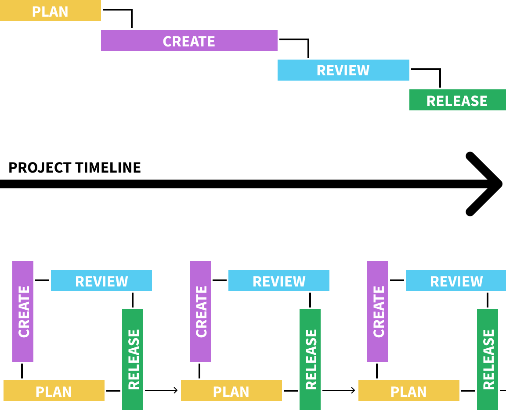
_Agile (bottom) in comparison with traditional "waterfall" project management methods (top)_ 

### Scrum

Agile frameworks include many techniques, **Scrum** and **Kanban** included. **Scrum** is an approach to Agile management with a focus on project teams, short "sprints," and daily stand-up meetings. It puts the project team front and center of the project, relying mainly on self-organization and self-management to get things done. 

Therefore, Scrum teams have clear visibility into the project (remember: transparency and clarity!). Project leaders can set their own priorities according to their knowledge of their team's capabilities.

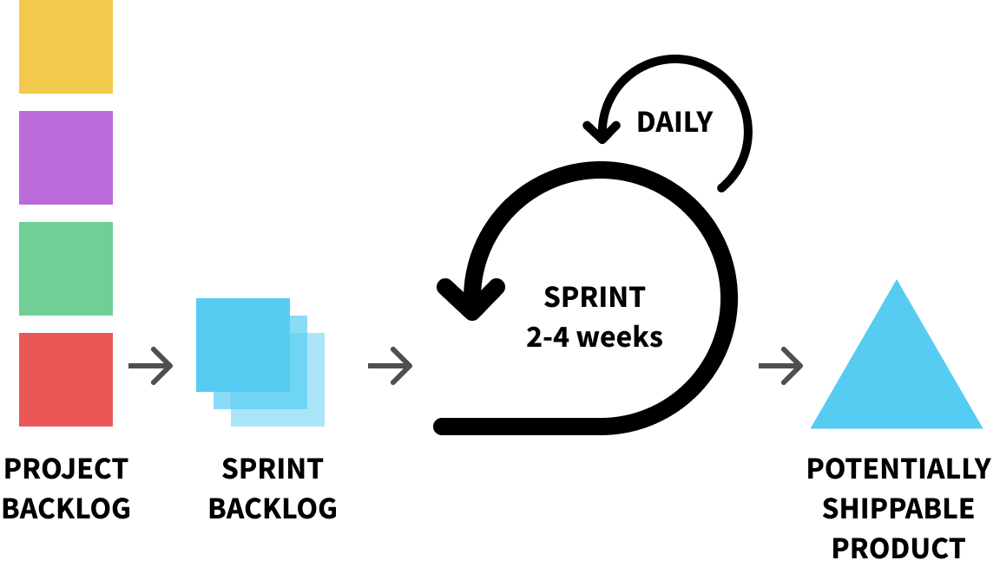
_Typical Scrum workflow_ 

### Kanban

One of the many tools Scrum teams rely on to perform their work efficiently is **Kanban boards**. 

**Kanban** (which is Japanese for "billboard"), was developed in the 1950s by an [industrial engineer at Toyota](LINK) as a scheduling system to improve manufacturing efficiencies. In practice, as the name suggests, it is composed of a series of cards on a board, which is used to visualize workflow.

_Toyota Production System (TPS) – Source: toyota-global.com_ 

When used as a project management tool, it helps team members to **visualize** tasks to be done within the wider context of the others. It limits the amount of work-in-progress and balances the workflow to avoid overburdening the team. In its essence, it is a **visual process management system that aids decision making about what, when, and how much to produce.**

It works like a little board game. Cards representing tasks are initially placed on a ***TODO*** column. Team members should them move them to an ***IN PROGRESS*** column as they work on each task. Finally, they move it to a ***DONE*** column and start again from the beginning for each subsequent task. 

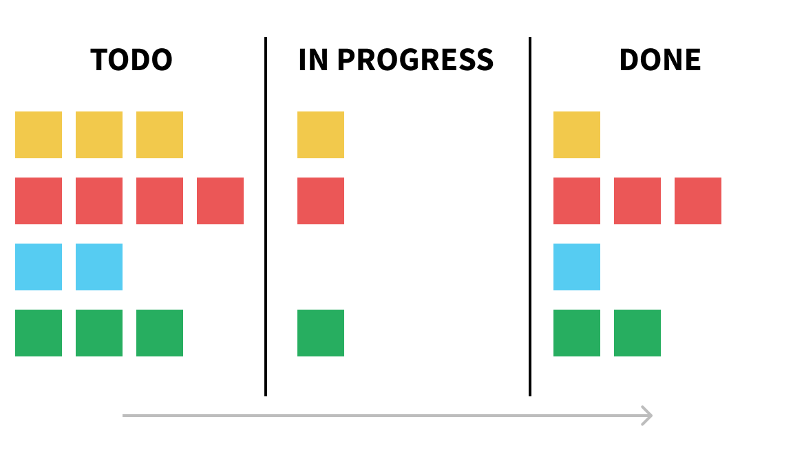
_A Kanban board in its simples form_ 

As you'll read later on, you can add more columns to the process (_TO REVIEW_, or _EMERGENCY_, for example). However, the ultimate goal is to visualize what needs to be done, what is being done, and what is finished. And adjust the process as it happens.

## When to use it?

I found that a Kanban board is most useful in a situation where you have many predefined tasks that need to be done by a fixed due date. 

It is perfect for the **production phase of a competition**, for example, after the design is frozen and the team needs to produce a delivery package. It also works well on the preparation phase for bit presentation and meetings, or when sprinting for project milestones. 

These examples are when most of the **overwork** happens. What I realized, however, is that it occurs not because there is too much to do, but because the team never has a clear picture of what is there to be done. They get assigned tasks and start working on them, hoping other people are busy with their assignments and that everything will come together at the end. There is also the tendency to multitask, switching tasks mid-process resulting in [a lot of lost time along the way](LINK).

Usually, the team has one **bottleneck**: their team leader and his ability to see and sensibly organize the whole picture. The leader has to visualize and understand all there is to be done, including new tasks that may suddenly arise. Priorities need to be adjusted, and they need to have a constant overview of all work in production. They also must keep track of how long each member takes to complete a task and adjust workflow accordingly. 

These are just some of the variables a team leader needs to keep track of. And one [can only do so much](LINK_how_many_tasks_a_brain_at_once) to juggle so many in their heads.

An organized manager has it all neatly planned in their computer, in nicely formatted spreadsheets and Gantt charts. They then check continuously with everyone who is doing what and try to keep their information always updated. They might even print some copies and pass around, or regularly email the sheets to the team. 

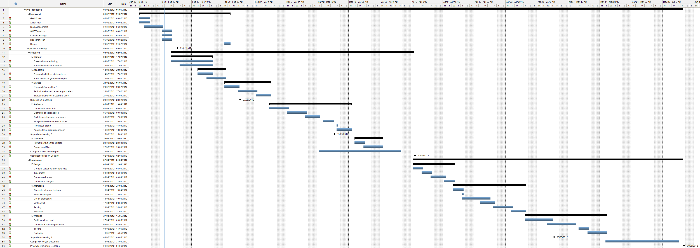
_Raise your hand if you ever saw one of these on your manager's screen?_ 

Can you see the problem with that? They are counting on everyone to be aware of their organization documents, while everyone is most concerned about their own work and what they should do. Everything else is "hidden" in their computers. It is an invitation for miscommunication, messy time management, and a stressful work environment.

A Kanban board comes to the rescue because it **transfers a lot of the management efforts from the leader to the team**. The bottleneck is suddenly gone. With a glance at the board, everyone knows what still needs to be done. Everyone always knows what each other is doing. And they all can see progress happening as the cards move through the board every day.

The team leader still has to make sure the board is updated and help the team navigate it, but most of the work is done collectively by the team. **It is a self-regulating process.** 

_(PS: I do recognize the importance and usefulness of Excel, Gantt charts, and other techniques for project management; I'm just trying to show there are better tools out there for certain types of projects, or project phases!)_

## Workflow example

I'll briefly describe my workflow with Kanban boards during production sprints.

As soon as we freeze the design, production starts. The first thing I do is go through the deliverables. I re-read the brief thoroughly to find out all requirements. I do rought layouts of boards or booklets and add placeholders to all that needs to be done. 

With a thick black pen, I transferred all these tasks to single _post-its_. Each _post-it_ would usually contain the overall topic ("diagram," "drawing," "delivery") followed by the task name, and a brief description when necessary. Better yet if the _post-its_ were colored, which helped at visual categorization.

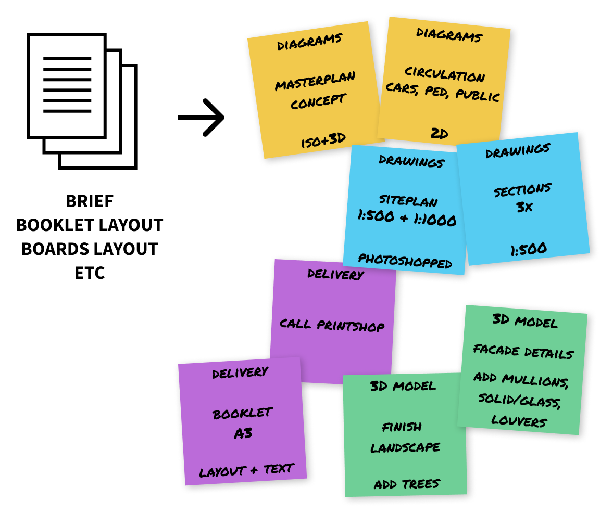
_Transferring tasks to post-its_ 

I would then print all the board titles and the team members' name tags (see templates). We defined our columns like this:

- **TODO** - all new tasks come into this column; other names could be "Icebox" or "Backlog."
- **DOING** - in this column, we would put the initials of all the team members, - including external consultants and partners; this would serve as a snapshot of the work currently being produced at any given time.
- **TRANSLATE** - (optional) while in China, we usually had to translate text in th e final deliverables; all cards in this column indicated finished tasks that still needed translation.
- **REVIEW** - all completed work would end up in this column before moving on to - DONE; this would signal what work was ready for review
- **DONE** - this the final column, where all tasks should end up in; in the end, all tasks from TODO should be here 

You can, of course, add or change columns as you see fit. The most basic board, however, should have at least three columns: _TODO_, _DOING_, _DONE_.

After labels were printed and the post-its were read, I would assemble the board on the wall and call in our first meeting. I would then go through all the post-its, explaining in detail each task. This gave everyone a good overview of the work to be done and made sure everyone understood how the board worked.

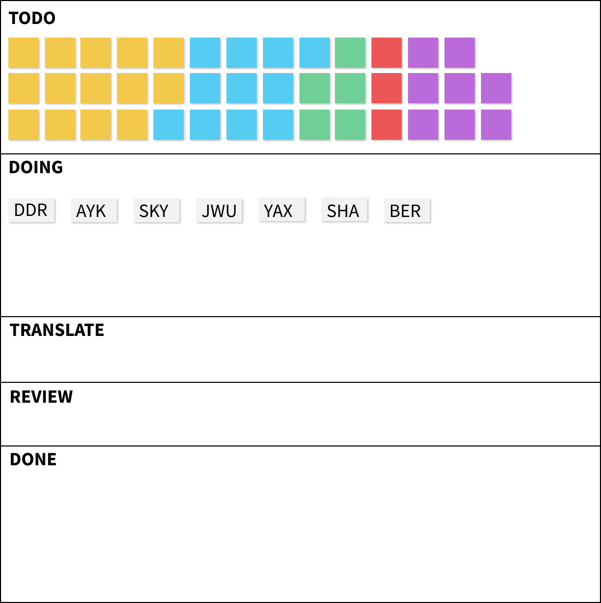
_Ah, the beauty of a new Kanban board! (we usually turned our columns into rows; it works either way)_ 

From then on, it was all about maintenance work. In our daily stand-up meetings, we would revise the board and get everyone on the same page. During the day, I would help out the team to pick new tasks or review completed work. You know, basic management work. But all on the open, on a nice Kanban board on the wall.

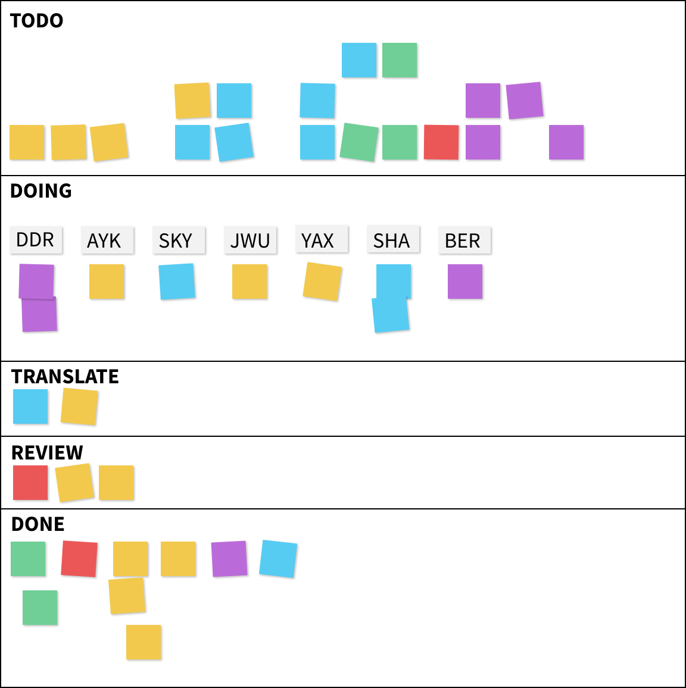
_Work in progress in a Kanban board: just looking at it tells you everything_

In the end, of course, we would take a picture to register how much work we did without any stress or overwork. All made possible by a Kanban board and the empowerment and transparency it brought to the whole team.

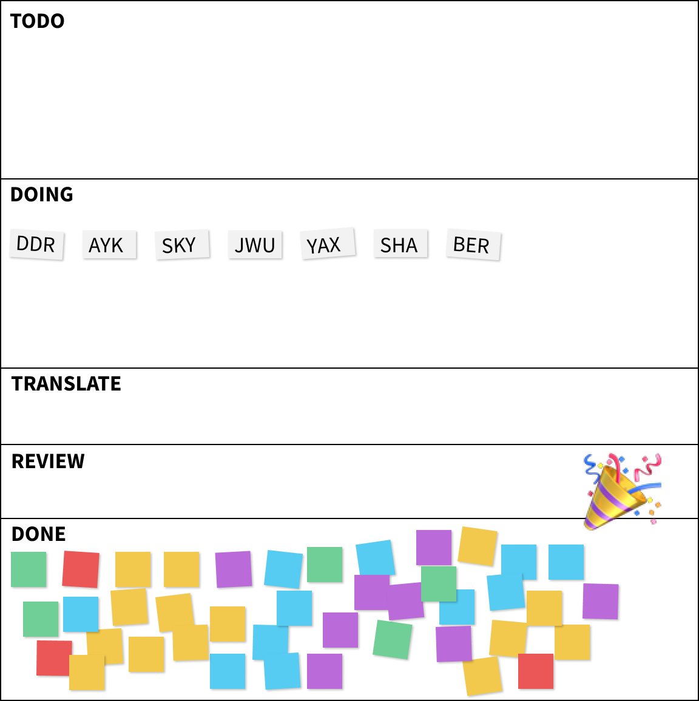
_The end goal of evert Kanban Board_

<divider/>

## The dos and don'ts of a Kanban board

Are you ready to implement a Kanban board with your team? If so, be aware of the following principles.

### Make it visible

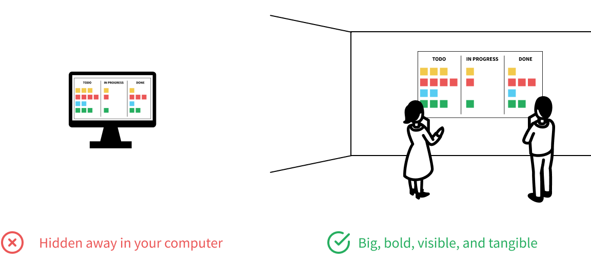

First of all, make it visible. Assemble a physical board somewhere in the office where the whole team can see it. Make it pretty and colorful. Use different colored _post-its_ for different task categories. 

The board (together with the project calendar) should be the main point of meetings with your team every day. It is a live snapshot of the whole production.

That is why I don't recommend you to use digital tools for your kanban board (such as [Trello](https://trello.com/) or [Asana](https://asana.com/)). If it lives in your computer, it creates a barrier of adoption that increases the risk of miscommunication and reduces transparency.

Once you put together the board's first version, make a small stand-up meeting around it with your team and go through all the tasks. This gives the team a pretty good picture of what work needs to be done, and help surface new tasks you might have forgotten in the first place.

### Avoid using it as an assignment board

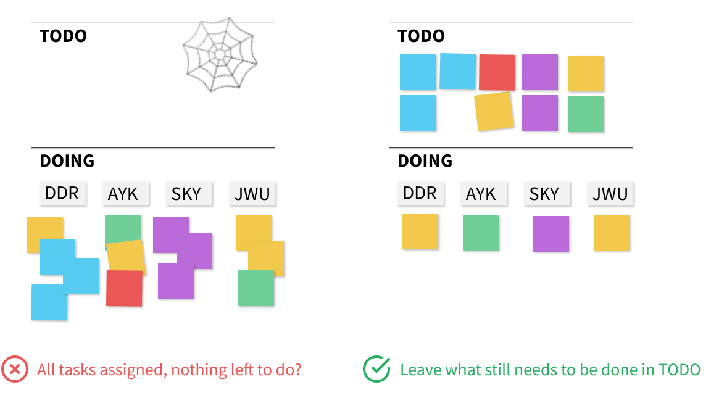

One of the most common mistakes people make when first encountering a Kanban board is to get all the tasks in the _TODO_ column and move over to each member's name, in an attempt to assign tasks.

However, the power of a Kanban board is that it **is not an assignment tool**. 

It is a display of all work to be done, a snapshot of what each person is doing, and a summary of what is already completed. 

By not creating assignments early on, you open the possibility for people to adjust their work and take on other tasks to help the team out, and not get lost in their own little list of tasks.

### Avoid task-hoarding

By not using it as an assignment tool, you can easily understand who is doing what at that exact moment. This will allow you to identify those team members that are doing too much at once. 

The general rule-of-thumb is that **each team member should be doing a single task at a time**. If you have someone with two or more tasks under their name, they should be either closely-related tasks or not be there at all. 

This principle minimizes work in progress and tries to avoid multitasking. Studies show that there is as much as 20% lost time as employees switch between different tasks without completing them, and the risk of errors and mistakes increases. Kanban, when used correctly, enforces a limit to the number of tasks any one person is doing at a point in time. **It is also beneficial for your team members because it reduces overburden and the interpersonal conflicts and frustrations that can arise from resource allocation decisions.**

Whenever a task is half started and waiting on something, it should be moved back to the _TODO_ column, preferably with an extra note explaining what is happening. Which brings us to our next rule.
 
### Keep it alive

As the project manager and team leader, your role is to **create** and **maintain** the board and help your team navigate it.

This means tending to it many times a day, conferring with your team members, updating tasks as they are completed, moving things around, and helping members pick up their next task.

Also, any new task that might come up, either by you, a team member or a third-party, should immediately go up on the _TODO_ list. This will avoid stress build up in your head (yes, [GTD](https://gettingthingsdone.com/) FTW). You'll trust the board as the single source of truth for all things that need to be done.

### Make sure to finish it

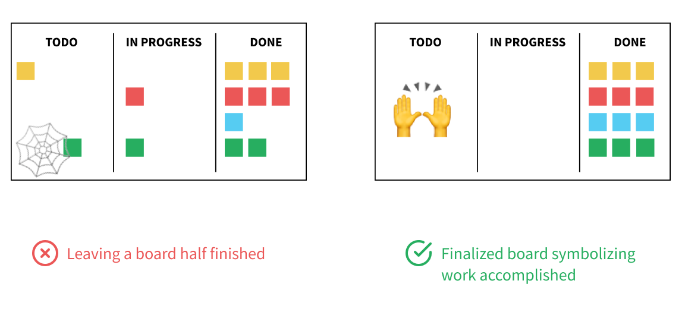

The ritual of keeping the board updated should go on until the end of the production phase. **Make a point to finish up the board, have all your post-its on the _DONE_ column, and do take a photo of it.**

In our first boards, we would usually forget about it in the last days of a sprint when most of the work was done, and the only tasks up were "Print Booklet" or "Schedule flights for delivery." We would then go back to the office after a well-deserved break and find the board "almost" finished.

Make it a point to finish the board. Before you leave on the last day, move all the done tasks to _DONE_. In most cases, you'll end up with several post-its in that column representing, physically, all the work done in the process. It has a powerful psychological effect. And it is also something you and your team can surely be proud of.

<divider/>

### Templates

I really want you to try it out. To help you, I prepared some templates you can use to Kickstart your next board: column titles and a small cheatsheet, both as an A4-PDF file for you to print.

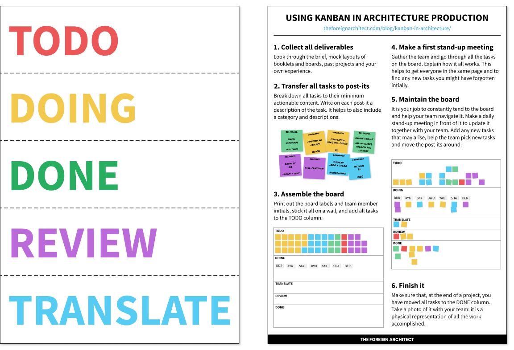

<mc-api-form sign-up-location="kanban" form-type="files">
  <template #title>Download the cheatshet</template>
  <template #description>Enter your email to receive a link to download the PDF files:</template>
  <template #submit>Get the link</template>
</mc-api-form>

---

Most importantly, have fun with it. Turn it into play, adapt it to your own situation, and use it as a simple, but powerful, agent of change within your practice.
